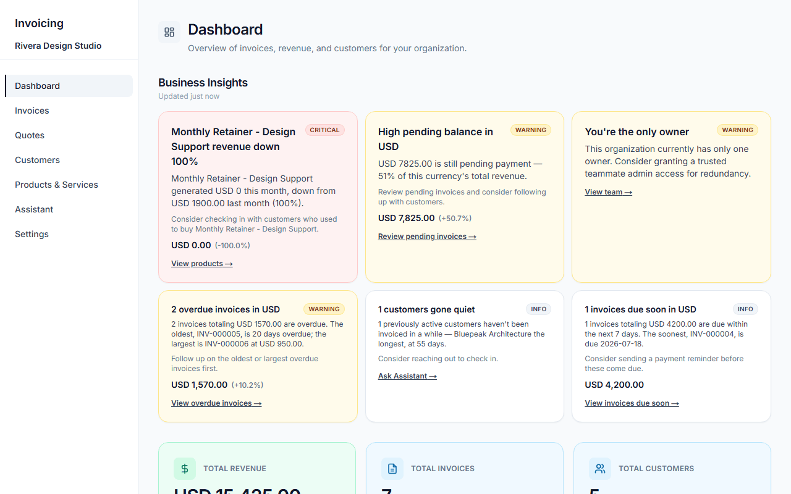
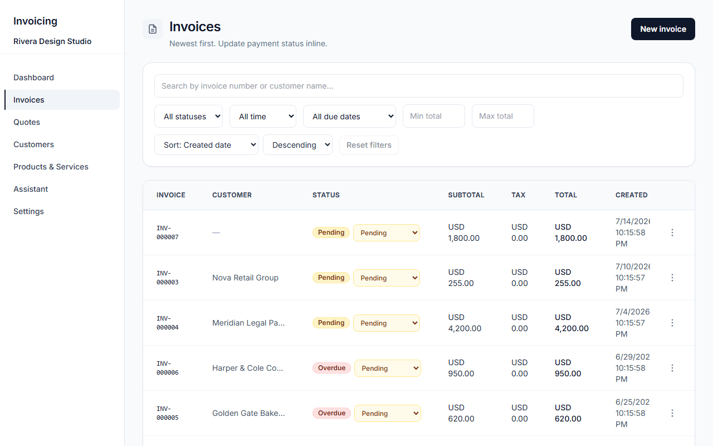
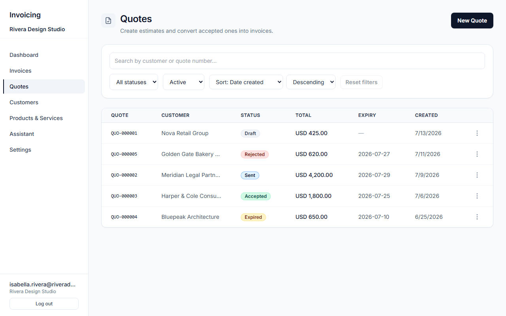
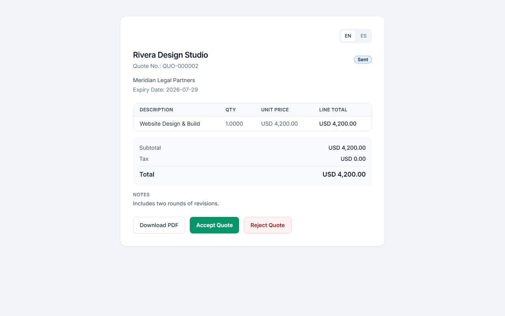
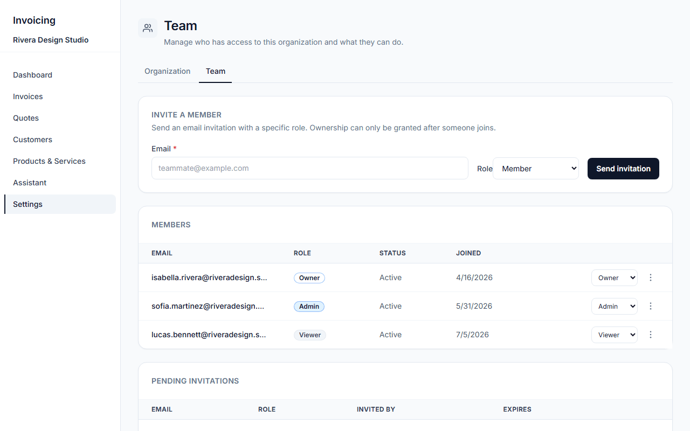
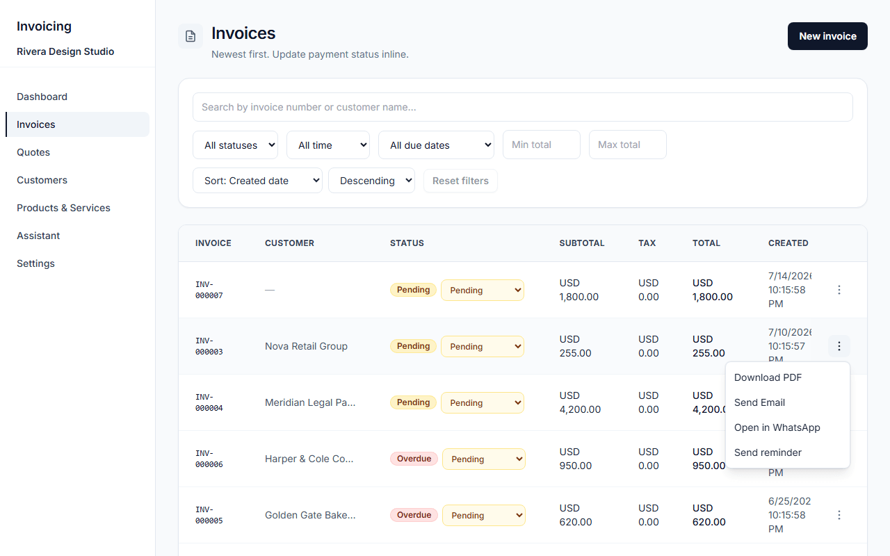
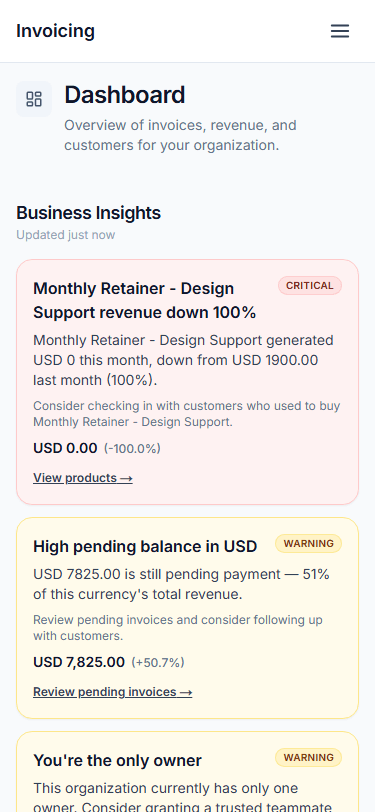
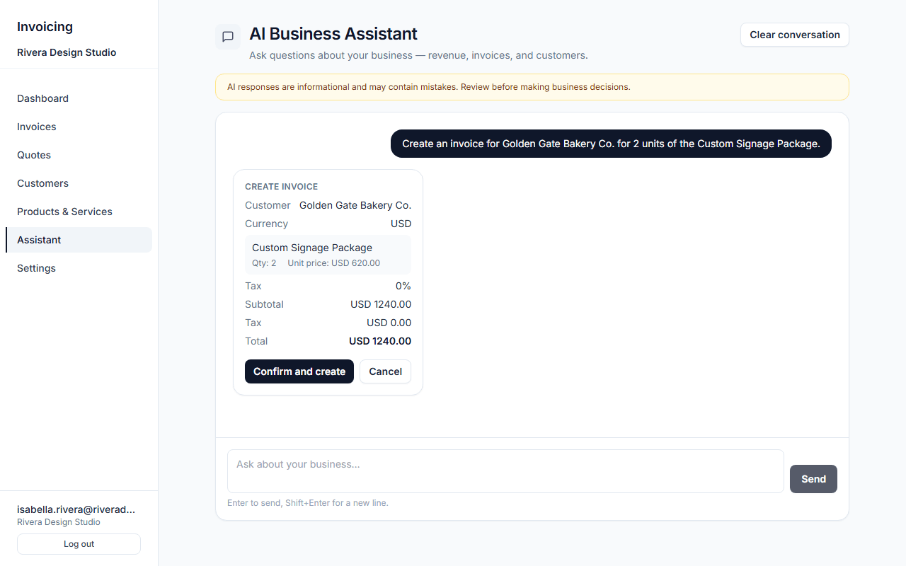

# Invoicing SaaS

**A production-grade, multi-tenant invoicing and quoting platform.** FastAPI +
Next.js, real tenant isolation, a permission system enforced across every
surface — including the AI agent — and infrastructure decisions built to
survive production, not a CRUD tutorial.



---

## Table of Contents

- [Overview](#overview)
- [Features](#features)
- [Screenshots](#screenshots)
- [Architecture](#architecture)
- [Tech Stack](#tech-stack)
- [Project Structure](#project-structure)
- [Getting Started](#getting-started)
- [Environment Variables](#environment-variables)
- [Testing](#testing)
- [Deployment](#deployment)
- [Security](#security)
- [Roadmap](#roadmap)
- [Contributing](#contributing)
- [License](#license)
- [Acknowledgements](#acknowledgements)

---

## Overview

Most invoicing tutorials stop at CRUD: create a customer, create an invoice,
done. This project starts from a harder question — what does it actually
take to run a multi-tenant product safely, with real permission boundaries,
an AI agent that can write to your database, and infrastructure choices
that would survive contact with production?

Every organization on this platform is fully isolated from every other one.
Every teammate a business invites gets exactly the access their role
grants — enforced the same way whether they're clicking a button in the UI
or asking the AI assistant to do it for them. The assistant itself never
writes anything without the user explicitly confirming first. Email and AI
providers are both swappable through a single environment variable, because
vendor lock-in is a production concern, not a tutorial one.

The result is a real, feature-complete invoicing and quoting product —
multi-currency, bilingual (English/Spanish), with bulk CSV/XLSX import,
WhatsApp sharing, scheduled payment reminders, and a business-insights
engine — built with the rigor of a system meant to actually run.

## Features

- **Invoicing** — create, email, and PDF-export invoices; due dates with
  automatic overdue detection; payment status tracking; scheduled due-date
  reminders.
- **Quotes** — full lifecycle (draft → sent → accepted / rejected / expired
  → converted to invoice); a public, no-login-required accept/reject link
  for customers; scheduled expiring-quote reminders.
- **Customers & Products** — full CRUD plus bulk CSV/XLSX import with
  column mapping and row-level validation.
- **Team & Permissions** — invite teammates by email across four roles
  (owner / admin / member / viewer), backed by 21 fine-grained permissions
  enforced identically on every REST endpoint *and* every AI tool call.
- **AI Business Assistant** — a chat assistant (Anthropic Claude or Google
  Gemini, swappable via one environment variable) that can draft invoices,
  quotes, and products. Every write action is proposed first and only
  executes after the user explicitly confirms it.
- **Communications** — transactional email (invoices, quotes, reminders,
  team invitations) via Resend; a one-click "Open in WhatsApp" action that
  prefills a message in the user's own WhatsApp — the app never sends
  anything on the user's behalf.
- **Localization** — a fully translated English/Spanish UI and email
  templates (850+ strings), with currency-aware number formatting.
- **Dashboard & Insights** — revenue and pipeline KPIs, top products/
  services, and a deterministic + AI-narrated insights engine that
  surfaces things like "revenue concentrated in one customer" before you'd
  notice it yourself.



## Screenshots

<table>
<tr>
<td width="50%">

**Quotes — full lifecycle**

Draft → Sent → Accepted / Rejected / Expired, at a glance.

</td>
<td width="50%">

**Public quote page — no login required**

The link a customer actually receives to accept or reject.

</td>
</tr>
<tr>
<td width="50%">

**Team & permissions**

Role-based access, enforced the same way on the backend and in the AI agent.

</td>
<td width="50%">

**"Open in WhatsApp"**

Prefills a message in the user's own WhatsApp — never sent by the app itself.

</td>
</tr>
</table>

**Mobile**


## Architecture

A few decisions in this codebase exist specifically *because* this is
meant to behave like a real product, not because a tutorial said to add
them:

**Multi-tenancy is structural, not incidental.** Every business-data table
foreign-keys to an `Organization`, and every route runs through
`require_org_member` / `require_permission` before touching the database.
Nothing trusts a client-supplied organization id beyond the caller's
verified membership — see `tests/tenants/` for the isolation tests that
prove it, including a dedicated test that the AI agent can't be tricked
into leaking across tenants.

**One permission list, three consumers.** `app/permissions.py` defines a
single `Permission` enum and a `ROLE_PERMISSIONS` map — the one source of
truth for "what can this role do." Backend routes call
`require_permission(...)`; the AI tool registry checks the same
permissions before a tool is even offered to the model; the frontend never
checks `role === "owner"` — it checks `hasPermission(self, "invoice.send")`
against a permissions array the backend computed. A future custom role
would light up the right buttons and tools everywhere, with zero changes
outside that one file.

**AI actions are proposed, then confirmed.** Chat streaming and action
execution are deliberately separate code paths. When the assistant wants
to create an invoice or update a record, it *proposes* the action; nothing
touches the database until the user explicitly confirms it in the UI. The
propose and confirm paths carry their own, tighter rate limits than
ordinary chat.


The assistant drafts the action and stops — nothing is written until "Confirm and create" is clicked.

**Providers are abstracted, not hardcoded.** Both the AI layer
(`app/ai/base.py`'s `AIProvider` interface, implemented by
`anthropic_provider.py` and `gemini_provider.py`) and the email layer
(`app/email/base.py`) sit behind a small interface. Switching from Claude
to Gemini, or plugging in a different email provider, is a configuration
change — the router, rate limiting, and frontend never know which
concrete provider is running underneath.

**Status is derived, not stored.** An invoice's `payment_status` is only
ever "pending" or "paid" at rest — whether it's actually *overdue* is
computed at read time from the current date, so "overdue" can never drift
out of sync with reality. Quotes follow the same pattern for expiry.

**Money is pinned at creation time.** An invoice or quote's currency (and
language) is snapshotted the moment it's created and never re-derived from
the organization's current settings — changing your organization's default
currency later can never silently rewrite a historical document.

## Tech Stack

| Layer | Technology |
| --- | --- |
| Backend | Python 3.12, FastAPI, SQLAlchemy 2.0, Pydantic v2 |
| Database | PostgreSQL in production, SQLite for zero-setup local dev |
| Auth | JWT (PyJWT) + bcrypt password hashing |
| AI | Anthropic Claude or Google Gemini, behind a provider abstraction |
| Email | Resend, behind a provider abstraction (swappable / no-op for tests) |
| Documents | ReportLab (PDF generation), openpyxl (XLSX import) |
| Frontend | Next.js 14 (App Router), React 18, TypeScript, Tailwind CSS |
| Charts | Recharts |
| Testing | pytest (162 backend tests) · Vitest + Testing Library (59 frontend tests) |
| Infra | Docker Compose, Neon (Postgres), Render (API), Vercel (frontend), GitHub Actions (scheduled jobs) |

## Project Structure

```
app/                      FastAPI backend
├── main.py               App instance, router registration, startup
├── models.py             SQLAlchemy models (15 tables)
├── schemas.py            Pydantic request/response schemas
├── permissions.py        Role → permission map (single source of truth)
├── deps.py               Auth / permission FastAPI dependencies
├── rate_limit.py         Rate limiting primitives
├── routers/              One file per resource (invoices, quotes,
│                         customers, products, team, assistant, ...)
├── services/             Business logic (invoices, quotes, products, team)
├── ai/                   Provider abstraction + agent tools
│   └── tools/            Agent tools + permission-checked registry
├── email/                Provider abstraction + templates
├── insights/             Deterministic + AI-narrated insights engine
├── imports/              CSV/XLSX bulk-import framework
└── jobs/                 Scheduled reminder jobs (due-date, expiry)

frontend/                 Next.js frontend
├── app/                  App Router pages
│   ├── (dashboard)/      Authenticated app (invoices, quotes,
│   │                     customers, products, team, assistant, settings)
│   ├── login/, accept-invitation/, ...   Public / auth pages
│   └── quotes/public/[token]/            Public quote accept/reject page
├── components/           Organized by domain, plus a shared ui/ design system
└── lib/                  API client, permissions, i18n, formatting helpers

tests/                    pytest suite, organized by domain (auth, tenants,
                          permissions, quotes, invoices, imports, AI, insights)
```

## Getting Started

### Quick start (Docker)

The fastest path — brings up Postgres, the backend, and the frontend
together, with zero configuration:

```bash
docker compose up --build
```

Frontend at `http://localhost:3000`, API at `http://localhost:8000`
(`/docs` for interactive API docs). Data persists across restarts in a
named volume. To enable real email or the AI assistant locally, copy
[`.env.docker.example`](.env.docker.example) to `.env` and fill in the
keys you want, then rerun the command above.

### Manual setup

```bash
# Backend
pip install -r requirements.txt
cp .env.example .env          # then edit — at minimum set JWT_SECRET_KEY
python -m app.seed_demo       # optional: prints demo login credentials
uvicorn app.main:app --reload

# Frontend (in a separate terminal)
cd frontend
npm install
cp ../.env.example .env.local
npm run dev
```

Backend at `http://127.0.0.1:8000`, frontend at `http://localhost:3000`.
On first load you'll land on `/login`, where you can sign in or register
a new account — registering also creates your organization.

### Database

`DATABASE_URL` unset falls back to a local SQLite file with foreign-key
enforcement turned on, so local behavior matches Postgres. Set it to a
`postgresql://` (or legacy `postgres://`) URL to use Postgres instead —
the scheme is rewritten to the `psycopg` v3 driver automatically. Tables
are created on startup via `Base.metadata.create_all()`; there's no
migration tool yet (see [Roadmap](#roadmap)).

## Environment Variables

| Variable | Default | Notes |
| --- | --- | --- |
| `DATABASE_URL` | `sqlite:///./invoices.db` | See [Database](#database) above. |
| `JWT_SECRET_KEY` | insecure dev default (warns) | Generate with `python -c "import secrets; print(secrets.token_urlsafe(48))"`. **Required** in production — the app refuses to start without it when `ENVIRONMENT=production`. |
| `ACCESS_TOKEN_EXPIRE_MINUTES` | `1440` (24h) | JWT access token lifetime. |
| `ENVIRONMENT` | `development` | Set to `production` when deploying. |
| `CORS_ALLOWED_ORIGINS` | local Next.js origins | Comma-separated list of frontend origins allowed to call the API. |
| `AI_PROVIDER` | `anthropic` | `anthropic` or `gemini`. Unknown values return a clean 503. |
| `ANTHROPIC_API_KEY` / `GEMINI_API_KEY` | unset (assistant returns 503) | Only the key matching `AI_PROVIDER` is ever read. Optional — the rest of the app works without either. |
| `AI_MODEL` | dev-only fallback; **required** in production | Never silently assumed once `ENVIRONMENT=production` — see `app/ai/factory.py`. |
| `AI_MAX_OUTPUT_TOKENS`, `AI_REQUEST_TIMEOUT_SECONDS`, `AI_MAX_*` | conservative defaults | Cost/abuse controls for the assistant, provider-agnostic. See `.env.example`. |
| `RESEND_API_KEY`, `EMAIL_FROM` | unset | Required for outbound email (invoices, quotes, reminders, invitations). Without them, sending fails safely (503) rather than crashing anything else. |
| `FRONTEND_BASE_URL` | local dev origin | Used to build links in outbound emails and public quote share links. |
| `NEXT_PUBLIC_API_URL` | `http://127.0.0.1:8000` | Frontend-side API base URL. |

## Testing

```bash
# Backend — 162 tests across auth, tenant isolation, permissions/rate
# limits, team/invitations, quotes, invoices/reminders, products/imports,
# AI assistant, and the insights engine.
pytest

# Frontend — 59 tests across components and lib helpers.
cd frontend && npm test
```

Tenant isolation and AI-agent permission enforcement are each covered by
dedicated test suites (`tests/tenants/`) rather than assumed — including a
test that specifically tries to trick the AI agent into acting across
organizations.

## Deployment

Three pieces, in order: a Postgres database (Neon), the API (Render), then
the frontend (Vercel). The last two have a circular dependency — the API
needs the frontend's URL for CORS, and the frontend needs the API's URL —
so you configure one, deploy the other, then close the loop.

1. **Database (Neon)** — create a project + database, copy the pooled
   connection string as `DATABASE_URL`. No schema migration step needed
   for a fresh database.
2. **Backend (Render)** — point Render's Blueprint feature at this repo
   ([`render.yaml`](render.yaml) has the build/start commands already
   filled in), or create a manual web service with
   `uvicorn app.main:app --host 0.0.0.0 --port $PORT`. Set
   `DATABASE_URL`, `JWT_SECRET_KEY`, `ENVIRONMENT=production`, and a
   placeholder `CORS_ALLOWED_ORIGINS` for now. AI/email variables are
   optional — leave them unset to ship without those features.
3. **Frontend (Vercel)** — import the repo, set **Root Directory** to
   `frontend`, set `NEXT_PUBLIC_API_URL` to the Render URL, deploy.
4. **Close the loop** — back in Render, set `CORS_ALLOWED_ORIGINS` to the
   real Vercel URL and redeploy.

**Scheduled reminders** (invoice due-date and quote-expiry emails) run as
a standalone job, not inside the web service — triggered in production by
[`.github/workflows/send-invoice-reminders.yml`](.github/workflows/send-invoice-reminders.yml),
a daily GitHub Actions cron. Wiring it up requires three repo secrets:
`DATABASE_URL`, `RESEND_API_KEY`, `EMAIL_FROM`.

## Security

- Passwords hashed with bcrypt; sessions are short-lived signed JWTs.
- Every resource is tenant-scoped at the query layer, not filtered after
  the fact — see [Architecture](#architecture).
- Permissions are enforced identically on REST routes and AI tool calls;
  the frontend's own gating is a UX convenience, never the source of
  truth.
- Rate limiting is per-user and per-IP, proxy-hop-aware (`TRUSTED_PROXY_HOPS`)
  so it can't be trivially bypassed by spoofing `X-Forwarded-For` behind a
  misconfigured reverse proxy.
- Bulk CSV/XLSX imports are row-validated before anything is written.
- Secrets are never committed — `.env*` is gitignored, and
  [`.env.example`](.env.example) documents every variable without values.

## Roadmap

- Database migrations via Alembic (schema currently only ever *adds*
  tables/columns on startup).
- Automated CI running the full test suite on every push/PR.
- Additional AI provider options.
- Richer public demo environment with realistic seed data.

## Contributing

Contributions are welcome. See [`CONTRIBUTING.md`](CONTRIBUTING.md) for
guidelines on running tests locally, coding conventions used throughout
this codebase (in particular: every new route needs an explicit
`require_permission` check, and frontend UI gating should always go
through `hasPermission()`, never a role-name comparison), and how to open
a pull request.

## License

MIT License — see [`LICENSE`](LICENSE) for details.

## Acknowledgements

Built on [FastAPI](https://fastapi.tiangolo.com/),
[Next.js](https://nextjs.org/), [SQLAlchemy](https://www.sqlalchemy.org/),
[Anthropic Claude](https://www.anthropic.com/) and
[Google Gemini](https://ai.google.dev/), [Resend](https://resend.com/),
[Neon](https://neon.tech/), [Render](https://render.com/), and
[Vercel](https://vercel.com/).
