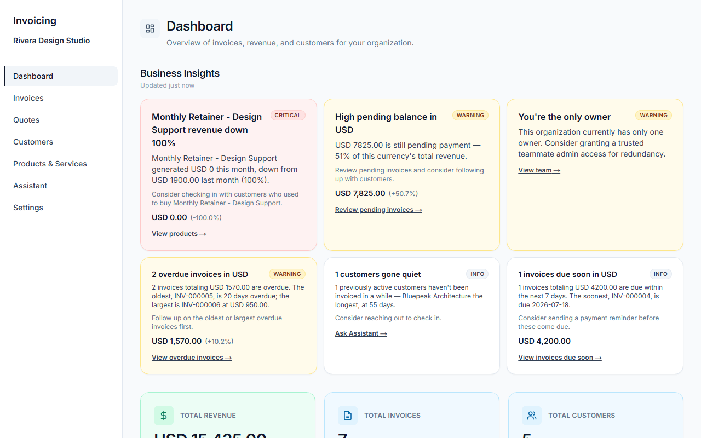
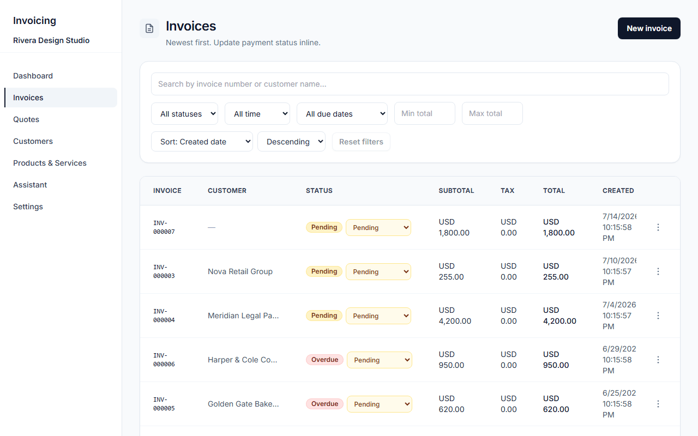
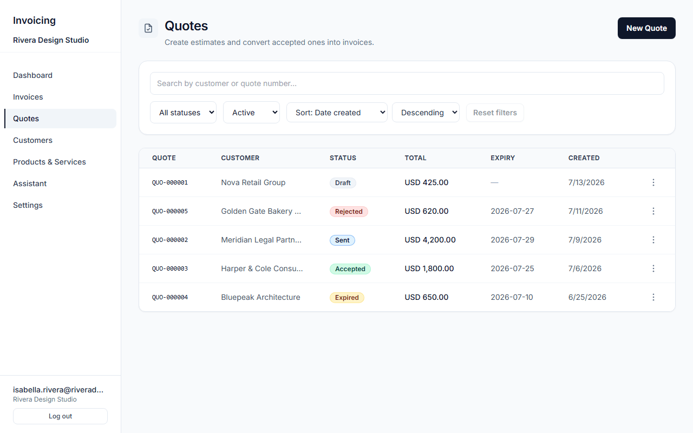
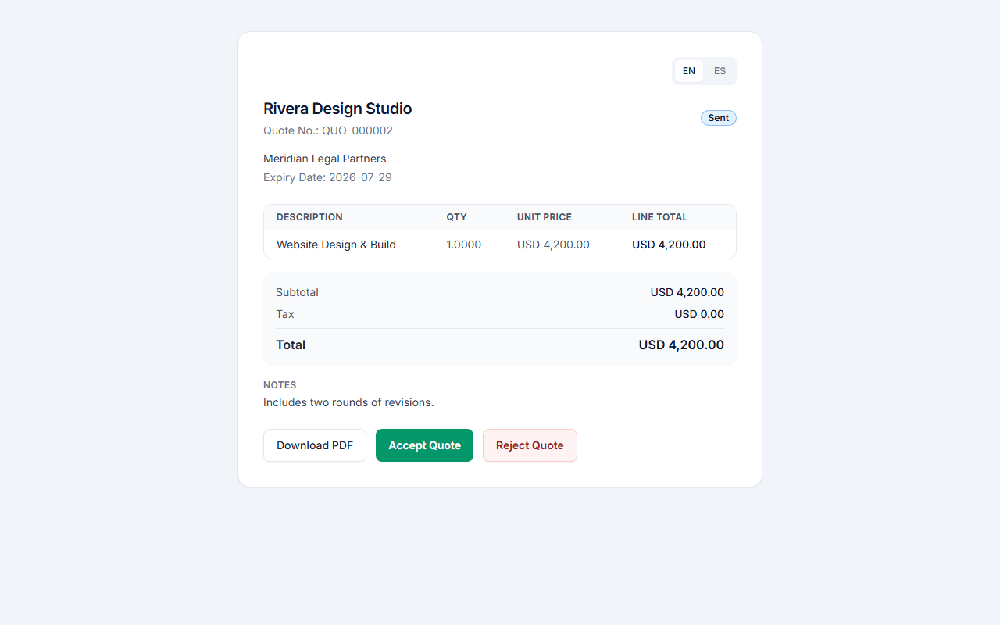
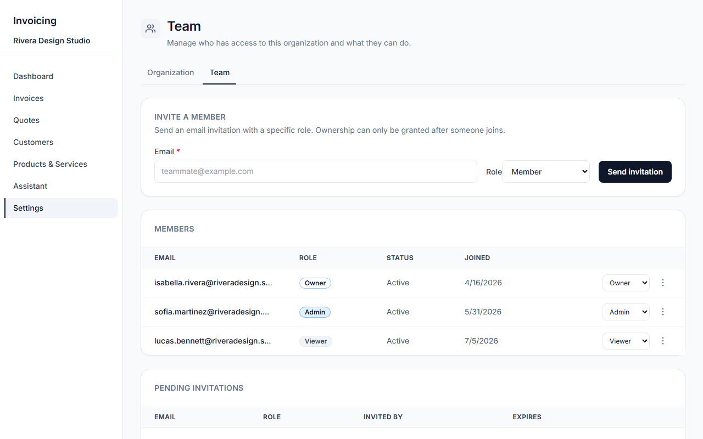
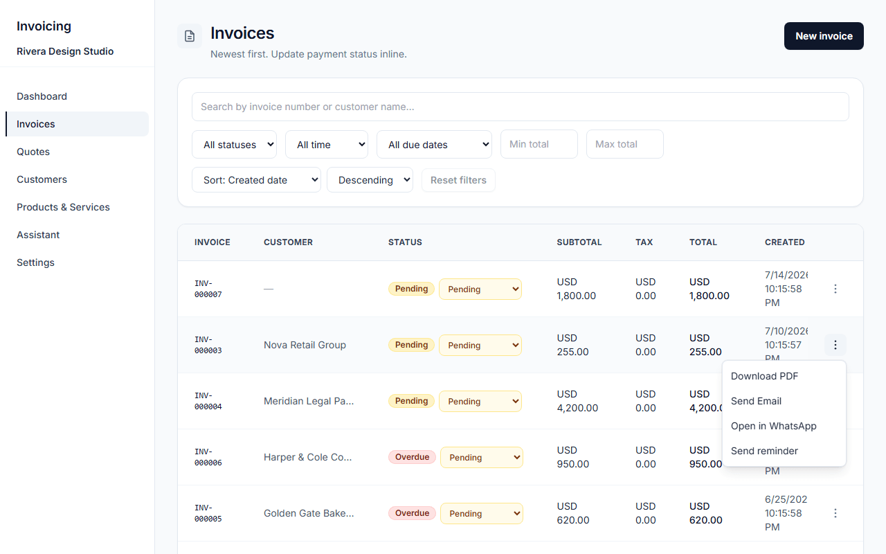
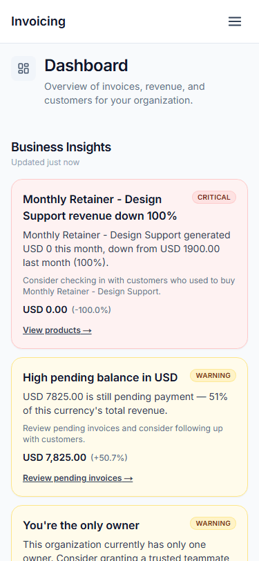
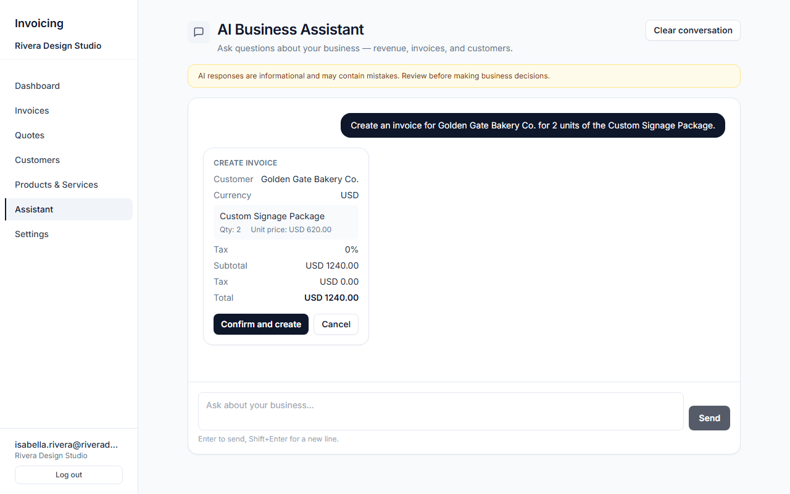

# Invoicing SaaS

**A production-grade, multi-tenant SaaS platform** for invoicing and
quoting: a public API and outbound webhooks for integrations, a durable
background-job queue, commercial plan enforcement wired to real payment
processing, and a platform-administration layer — all built on tenant
isolation and a permission system enforced across every surface,
including the AI agent.



[](https://github.com/OWNER/REPO/actions/workflows/ci.yml)


> Replace `OWNER/REPO` in the CI badge URL above with this repository's
> actual GitHub path once it's pushed — see
> [`docs/github-polish.md`](docs/github-polish.md) for the full badge
> set and where each one's data comes from.

---

## Table of Contents

- [Overview](#overview)
- [Key Features](#key-features)
- [Screenshots](#screenshots)
- [Architecture Overview](#architecture-overview)
- [Technology Stack](#technology-stack)
- [Project Structure](#project-structure)
- [Local Development](#local-development)
- [Production Deployment](#production-deployment)
- [Environment Variables](#environment-variables)
- [Testing](#testing)
- [CI](#ci)
- [Security](#security)
- [Documentation](#documentation)
- [Roadmap](#roadmap)
- [Contributing](#contributing)
- [License](#license)

---

## Overview

Most invoicing tutorials stop at CRUD: create a customer, create an
invoice, done. This project starts from a harder question — what does it
take to run a multi-tenant SaaS platform that other systems can safely
integrate with, that an operations team can administer, and that would
survive contact with production and real paying customers?

Every organization is isolated from every other at the structural level,
not by convention. Every teammate gets exactly the access their role
grants — enforced the same way whether they're clicking a button in the
UI, calling the public REST API with a scoped API key, or asking the AI
assistant to do it for them. Commercial plans gate what an organization
can do and how much of it, enforced at the point of the write, not just
displayed on a pricing page — and, when a payment provider is configured,
those plan changes actually move a real Stripe subscription, not just a
database row. A platform-operations layer, separate from any tenant,
lets operators suspend organizations, manage plans, and inspect the job
queue, with every action written to an audit log nobody can edit after
the fact.

Integrations are a first-class citizen, not an afterthought. Organizations
can generate scoped, hashed API keys for machine access, and subscribe
external systems to webhook events with HMAC-signed payloads. Delivery is
durable: every event is persisted transactionally before anything is sent
over the network, executed by a background worker process that survives
crashes and restarts, and retried on a backoff schedule if the receiving
end is down.

The result is a feature-complete invoicing and quoting product —
multi-currency, bilingual (English/Spanish), with bulk CSV/XLSX import,
WhatsApp sharing, scheduled payment reminders, and a business-insights
engine — wrapped in the operational scaffolding a SaaS company needs to
run it: audit logging, usage tracking, durable background jobs, platform
administration, and a UI that's genuinely usable on a phone, not just
"technically responsive."

For a deeper technical walkthrough of *why* the system is shaped this
way — request lifecycle, auth, RBAC, billing, the event pipeline,
webhooks, background jobs — see [`docs/architecture.md`](docs/architecture.md).
For the engineering story behind the harder decisions (written for a
technical interview, not a changelog), see
[`docs/portfolio.md`](docs/portfolio.md).

## Key Features

- **Invoicing** — create, email, and PDF-export invoices; due dates with
  automatic overdue detection; payment status tracking; scheduled due-date
  reminders; a permanent snapshot of the billed customer's details taken
  at issuance, so editing a customer later can never rewrite a document
  that already went out.
- **Quotes** — full lifecycle (draft → sent → accepted / rejected / expired
  → converted to invoice, immutable once accepted/rejected/converted); a
  public, no-login-required accept/reject link for customers; scheduled
  expiring-quote reminders.
- **Customers & Products** — full CRUD plus bulk CSV/XLSX import with
  column mapping and row-level validation.
- **Team & Permissions** — invite teammates by email across four roles
  (owner / admin / member / viewer), backed by 22 fine-grained permissions
  enforced identically on every REST endpoint *and* every AI tool call. A
  row-level lock guarantees an organization can never be left with zero
  owners, even under two concurrent demote/remove requests.
- **Public API & API Keys** — a versioned REST API (`/api/v1/customers`,
  `/products`, `/quotes`, `/invoices`) for programmatic access, authenticated
  by scoped, hashed API keys — never a user's session token — each carrying
  its own permission grants and usage accounting.
- **Outbound Webhooks & Durable Background Jobs** — subscribe external
  systems to lifecycle events (customer/product/quote changes). Every
  event is persisted transactionally and delivered by a database-backed
  job queue running in a separate worker process, with HMAC-signed
  payloads, a full append-only delivery history, and automatic retries on
  a backoff schedule when a receiver is down or slow. Delivery survives a
  worker crash or restart — nothing queued is silently lost.
- **Billing, wired to Stripe** — commercial plans (seats, monthly
  document volume, storage, feature flags) are enforced at the point of
  every write, and — when `BILLING_PROVIDER=stripe` is configured — plan
  changes, cancellations, and reactivations actually move a real Stripe
  subscription, with optimistic concurrency protecting against a
  platform-admin action and an incoming Stripe webhook racing on the
  same row. See [Billing & Stripe](docs/architecture.md#billing--stripe).
- **AI Business Assistant** — a chat assistant (Anthropic Claude or Google
  Gemini, swappable via one environment variable) that can draft invoices,
  quotes, and products. Every write action is proposed first and only
  executes after the user explicitly confirms it, gated by the same plan
  entitlement every other AI surface in the app respects.
- **Platform Administration** — a separate operator console, invisible to
  tenants, for suspending/reactivating organizations, managing commercial
  plans and platform-wide settings, and inspecting the job queue. Every
  administrative action — a suspension, a plan change, a job retry — is
  logged immutably, with an actor and a reason attached.
- **Usage Tracking & Plan Enforcement** — every organization sits on a
  commercial plan; usage is tracked in real time and enforced against the
  plan's limits synchronously, at the point a limited resource is
  created.
- **Communications** — transactional email (invoices, quotes, reminders,
  team invitations) via Resend; a one-click "Open in WhatsApp" action that
  prefills a message in the user's own WhatsApp — the app never sends
  anything on the user's behalf.
- **Localization** — a fully translated English/Spanish UI and email
  templates (1,300+ strings per language), with currency-aware number
  formatting.
- **Dashboard & Insights** — revenue and pipeline KPIs, top products/
  services, and a deterministic + AI-narrated insights engine that
  surfaces things like "revenue concentrated in one customer" before you'd
  notice it yourself.
- **Mobile-first, not mobile-tolerant** — every list, filter toolbar,
  navigation strip, and modal is built to never force a horizontal page
  scroll, down to a 320px viewport; verified in-browser at five widths,
  not just assumed from a CSS framework's defaults.
- **WhatsApp Assistant** *(experimental, unofficial, disabled by default —
  see [`docs/whatsapp.md`](docs/whatsapp.md))* — the same AI Business
  Assistant above, reachable over WhatsApp text and voice messages, behind
  a separate transport bridge, phone-number verification, and the
  identical propose/confirm lifecycle every other AI action already uses.
  Not an official WhatsApp Business/Meta Cloud API integration.
- **Financial Dashboard** *(deterministic — no AI; see
  [`docs/financial_dashboard.md`](docs/financial_dashboard.md))* — a
  dedicated `/analytics/financial` page: executive KPIs with real
  previous-period comparisons, monthly revenue/collections trends,
  accounts-receivable aging, customer concentration and at-risk
  detection, product performance, the quote funnel, and a receivables
  collections calendar — every figure grouped by currency, computed
  entirely from real invoice and quote data, plan-gated separately from
  the base Analytics page.
- **Revenue Forecasting** *(deterministic — no AI; see
  [`docs/revenue_forecasting.md`](docs/revenue_forecasting.md))* — extends
  the Financial Dashboard with 30/90/180/365-day revenue forecasts and
  30/90/180-day expected-collections projections, selected automatically
  from 4 classic time-series models via rolling-origin backtesting, with
  an honest confidence tier and interval on every number, Base/Optimistic/
  Conservative scenario controls, deterministic anomaly flags, and a CSV
  export — soft-gated by plan (never a hard error, just an honest
  "not included" state).



## Screenshots

<table>
<tr>
<td width="50%">

**Quotes — full lifecycle**

Draft → Sent → Accepted / Rejected / Expired, at a glance.

</td>
<td width="50%">

**Public quote page — no login required**

The link a customer actually receives to accept or reject.

</td>
</tr>
<tr>
<td width="50%">

**Team & permissions**

Role-based access, enforced the same way on the backend and in the AI agent.

</td>
<td width="50%">

**"Open in WhatsApp"**

Prefills a message in the user's own WhatsApp — never sent by the app itself.

</td>
</tr>
</table>

**Mobile**


> The image files above are **placeholders that don't exist in the repo
> yet** — every path under `docs/screenshots/` needs to be captured
> before this README renders images instead of broken links. See
> [`docs/screenshots.md`](docs/screenshots.md) for the complete shot
> list (page, viewport, and purpose for every recommended screenshot) and
> [`docs/demo.md`](docs/demo.md) for a live-demo script that doubles as a
> capture checklist.

## Architecture Overview

A few decisions in this codebase exist specifically *because* this is
meant to behave like a real product, not because a tutorial said to add
them. The full technical write-up — with request-lifecycle, auth-flow,
and event-pipeline diagrams — lives in
[`docs/architecture.md`](docs/architecture.md); this is the short version.

**Two cooperating backend processes, one database, no broker.** The web
API handles requests and enqueues durable work; a separate
`python -m app.jobs.worker` process claims and executes it (webhook
delivery, notification email). Neither can affect the other except
through shared database state — the web process can never itself
perform an outbound webhook delivery, so a slow or unreachable receiver
can never make an API request hang.

**Multi-tenancy is structural, not incidental.** Every business-data
table foreign-keys to an `Organization`, and every route runs through
`require_org_member` / `require_permission` before touching the
database. Nothing trusts a client-supplied organization id beyond the
caller's verified membership — see `tests/tenants/` for the isolation
tests that prove it, including a dedicated test that the AI agent can't
be tricked into leaking across tenants.

**One permission list, three consumers.** `app/permissions.py` defines a
single `Permission` enum and a `ROLE_PERMISSIONS` map — the one source of
truth for "what can this role do inside its own organization." Backend
routes call `require_permission(...)`; the AI tool registry checks the
same permissions before a tool is even offered to the model; the frontend
never checks `role === "owner"` — it checks
`hasPermission(self, "invoice.send")` against a permissions array the
backend computed.

**Platform administration is a separate permission system, never merged
with the one above.** An organization owner has zero platform-level
access no matter how their organization is configured, and a platform
operator's access to tenant data is limited to exactly what the
platform-admin surfaces expose — never a backdoor into an organization's
actual business records.

**The event pipeline is one frozen entry point, four consumers.**
`emit_event()` is the single call every business service makes to raise
a domain event — it fans out, inside the *same* open transaction, to
outbound webhooks, in-app notifications, transactional email, and the
tenant audit timeline. A business service has zero awareness any of
those four channels exist.

**AI actions are proposed, then confirmed.** Chat streaming and action
execution are deliberately separate code paths. When the assistant wants
to create an invoice or update a record, it *proposes* the action;
nothing touches the database until the user explicitly confirms it in
the UI.


The assistant drafts the action and stops — nothing is written until "Confirm and create" is clicked.

**Billing is provider-abstracted, and now actually wired.** `BillingService`
depends on a `BillingProvider` interface, never a concrete SDK —
`NullBillingProvider` (the default) fails closed rather than silently
no-oping, and `StripeProvider` is the first real implementation. Every
subscription mutation that should reach Stripe does, exactly once,
*before* any local state changes, with a deterministic Idempotency-Key
guarding against duplicate charges on retry.

**Status is derived, not stored.** An invoice's `payment_status` is only
ever "pending" or "paid" at rest — whether it's actually *overdue* is
computed at read time from the current date. Quotes follow the same
pattern for expiry.

**Money is pinned at creation time.** An invoice or quote's currency,
language, and billed-customer details are snapshotted the moment it's
created and never re-derived later — changing your organization's
default currency, or editing a customer's address, can never silently
rewrite a historical document.

Full detail — including Mermaid diagrams for the request lifecycle, auth
flow, organization isolation, RBAC, billing/Stripe, the event pipeline,
notifications, audit, background jobs, webhooks, and the platform
dashboard — is in [`docs/architecture.md`](docs/architecture.md).

## Technology Stack

| Layer | Technology |
| --- | --- |
| Backend | Python 3.12, FastAPI, SQLAlchemy 2.0, Pydantic v2 |
| Database | PostgreSQL in production, SQLite for zero-setup local dev |
| Background Jobs | Database-backed durable queue (`BackgroundJob` table), executed by a separate worker process — no message broker |
| Auth | JWT (PyJWT) + bcrypt password hashing; scoped, hashed API keys for machine-to-machine access |
| Billing | Stripe, behind a `BillingProvider` interface (optional — commercial plans are enforced with or without it configured) |
| AI | Anthropic Claude or Google Gemini, behind a provider abstraction |
| Email | Resend, behind a provider abstraction (swappable / no-op for tests) |
| Documents | ReportLab (PDF generation), openpyxl (XLSX import) |
| Frontend | Next.js 14 (App Router), React 18, TypeScript, Tailwind CSS |
| Charts | Recharts |
| Testing | pytest (985 backend tests) · Vitest + Testing Library (285 frontend tests) |
| CI | GitHub Actions — merge-blocking on every PR and push to `main` |
| Infra | Docker Compose (dev, and prod via `docker-compose.prod.yml` + Caddy), Neon (Postgres), Render (API + worker), Vercel (frontend), GitHub Actions (scheduled jobs) |

## Project Structure

```
app/                      FastAPI backend
├── main.py               App instance, router registration, startup
├── models.py              SQLAlchemy models (33 tables)
├── schemas.py             Pydantic request/response schemas
├── permissions.py         Org-level role → permission map
├── platform_permissions.py  Platform-operator role → permission map
│                             (separate from app/permissions.py)
├── deps.py                Auth / permission FastAPI dependencies
├── rate_limit.py           Rate limiting primitives
├── webhook_signing.py      HMAC request signing for outbound webhooks
├── webhook_ssrf.py         SSRF protection for webhook endpoint URLs
├── api_keys.py             API key generation / hashing
├── job_type.py, job_status.py, job_config.py   Background-job primitives
├── routers/                One file per resource — invoices, quotes,
│                            customers, products, team, assistant,
│                            webhooks, api_key_management, platform_admin,
│                            billing, billing_webhooks, audit, notifications
│   └── api_v1/              Public REST API, authenticated by API key
├── services/                Business logic — invoices, quotes, products,
│                            team, webhook_events, webhook_deliveries,
│                            background_jobs, entitlements, plan_limits
├── billing/                 Provider-agnostic billing domain + Stripe
│                            implementation (see docs/billing_providers.md)
├── notifications/           Event-pipeline fan-out (see docs/notifications.md)
├── audit/                   Tenant audit-timeline write path
├── jobs/                    Durable job registry, handlers, and the
│   ├── worker.py             standalone worker process entrypoint
│   ├── registry.py           job-type registry
│   └── handlers/             one handler module per job type
├── ai/                      Provider abstraction + agent tools
│   └── tools/                 Agent tools + permission-checked registry
├── email/                   Provider abstraction + templates
├── insights/                 Deterministic + AI-narrated insights engine
└── imports/                  CSV/XLSX bulk-import framework

frontend/                 Next.js frontend
├── app/                   App Router pages
│   ├── (dashboard)/        Authenticated tenant app (invoices, quotes,
│   │                       customers, products, team, assistant, settings)
│   └── (admin)/admin/      Platform administration console (organizations,
│                           users, plans, subscriptions, background jobs,
│                           audit log, settings)
├── components/             Organized by domain, plus a shared ui/ design system
└── lib/                    API client, permissions, i18n, formatting helpers

tests/                    pytest suite, organized by domain (auth, tenants,
                          permissions, quotes, invoices, imports, AI,
                          insights, webhooks, background jobs, billing,
                          team, platform_admin)

docs/                     Deep-dive architecture, deployment, demo, and
                          portfolio documentation — see Documentation below
```

## Local Development

### Quick start (Docker)

The fastest path — brings up Postgres, the backend, the background-job
worker, and the frontend together, with zero configuration:

```bash
docker compose up --build
```

Frontend at `http://localhost:3000`, API at `http://localhost:8000`
(`/docs` for interactive API docs). Data persists across restarts in a
named volume. To enable real email or the AI assistant locally, copy
[`.env.docker.example`](.env.docker.example) to `.env` and fill in the
keys you want, then rerun the command above.

The experimental WhatsApp bridge is **not** part of this default stack —
it's an opt-in Compose profile (`docker compose --profile whatsapp up
--build`); see [`docs/whatsapp.md`](docs/whatsapp.md).

### Manual setup

```bash
# Backend
pip install -r requirements.txt
cp .env.example .env          # then edit — at minimum set JWT_SECRET_KEY
python -m app.seed_demo       # optional: prints demo login credentials
uvicorn app.main:app --reload

# Frontend (in a separate terminal)
cd frontend
npm install
cp ../.env.example .env.local
npm run dev

# Background worker (optional, separate terminal) — only needed to
# deliver outbound webhooks/notification emails. Without it, events and
# jobs still persist durably; they simply queue up undelivered until a
# worker runs.
python -m app.jobs.worker
```

Backend at `http://127.0.0.1:8000`, frontend at `http://localhost:3000`.
On first load you'll land on `/login`, where you can sign in or register
a new account — registering also creates your organization, with you as
its owner. See [`docs/demo.md`](docs/demo.md) for a ready-made demo
account and a scripted walkthrough of every major surface.

### Database

`DATABASE_URL` unset falls back to a local SQLite file with foreign-key
enforcement turned on, so local behavior matches Postgres. Set it to a
`postgresql://` (or legacy `postgres://`) URL to use Postgres instead —
the scheme is rewritten to the `psycopg` v3 driver automatically. Tables
are created on startup via `Base.metadata.create_all()`, and a small,
hand-written set of idempotent, additive-only migrations
(`app/schema_migrations.py`) brings an existing database's schema
forward on every startup — there's no Alembic yet (see
[Roadmap](#roadmap)).

## Production Deployment

> For the full production release-readiness reference (environment
> variable checklist, health endpoints, logging, backup strategy,
> security headers, CORS/rate-limiting verification, monitoring hooks,
> and a release checklist) see [`docs/deployment.md`](docs/deployment.md).
> The walkthrough below covers only the managed Render+Vercel+Neon path;
> `docs/deployment.md` also documents a self-hosted alternative using
> [`docker-compose.prod.yml`](docker-compose.prod.yml) (Postgres + backend
> + worker + frontend + Caddy for automatic HTTPS) for deploying to your
> own server instead.

This application runs as **two cooperating backend processes**, not one:
the **web API** (handles requests, enqueues work, never executes it) and
the **background worker** (claims and executes durable jobs — currently,
webhook delivery and notification email). Both read from the same
database and the same job queue table; neither can affect the other
except through that shared state. Running only the web process is a
valid deployment — events and jobs still persist durably — but nothing
is *delivered* until a worker claims the backlog.

Four pieces, in order: a Postgres database (Neon), the web API (Render),
the background worker (Render), then the frontend (Vercel). The API and
frontend have a circular dependency — the API needs the frontend's URL for
CORS, and the frontend needs the API's URL — so you configure one, deploy
the other, then close the loop.

1. **Database (Neon)** — create a project + database, copy the pooled
   connection string as `DATABASE_URL`. No schema migration step needed
   for a fresh database.
2. **Web API (Render)** — point Render's Blueprint feature at this repo
   ([`render.yaml`](render.yaml) has the build/start commands already
   filled in), or create a manual web service with
   `uvicorn app.main:app --host 0.0.0.0 --port $PORT`. Set
   `DATABASE_URL`, `JWT_SECRET_KEY`, `ENVIRONMENT=production`, and a
   placeholder `CORS_ALLOWED_ORIGINS` for now. AI/email/billing variables
   are optional — leave them unset to ship without those features.
3. **Background Worker (Render)** — a second Render service
   (`type: worker`, `python -m app.jobs.worker`) sharing the same
   `DATABASE_URL` and `JWT_SECRET_KEY` as the web service above. The block
   is commented out in [`render.yaml`](render.yaml) because it requires
   Render's paid tier — the free tier covers exactly one web service, not
   a second always-on process. Until this is deployed, the app behaves
   correctly and nothing is lost; webhook events and notification emails
   simply queue up undelivered. See
   [`docs/architecture.md`](docs/architecture.md#system-architecture) for
   why that split is safe.
4. **Frontend (Vercel)** — import the repo, set **Root Directory** to
   `frontend`, set `NEXT_PUBLIC_API_URL` to the Render URL, deploy.
5. **Close the loop** — back in Render, set `CORS_ALLOWED_ORIGINS` to the
   real Vercel URL and redeploy.

**Scheduled reminders** (invoice due-date and quote-expiry emails) run as
a standalone job, not inside the web service — triggered in production by
[`.github/workflows/send-invoice-reminders.yml`](.github/workflows/send-invoice-reminders.yml),
a daily GitHub Actions cron, unrelated to the webhook worker above.
Wiring it up requires three repo secrets: `DATABASE_URL`,
`RESEND_API_KEY`, `EMAIL_FROM`.

**Stripe billing** is configured entirely through environment variables
(`BILLING_PROVIDER=stripe` + `STRIPE_API_KEY` + `STRIPE_WEBHOOK_SECRET`
+ one `STRIPE_PRICE_ID__<PLAN>__<PERIOD>` per sellable plan/period — see
[Environment Variables](#environment-variables)) and requires no code
change to enable. It is documented for the manual/direct-run path today;
wiring those same variables into `render.yaml` and the Docker Compose
files is a small, tracked follow-up (see [Roadmap](#roadmap)) rather than
something already done for you in those configs.

## Environment Variables

| Variable | Default | Notes |
| --- | --- | --- |
| `DATABASE_URL` | `sqlite:///./invoices.db` | See [Database](#database) above. Shared by the web and worker processes. |
| `JWT_SECRET_KEY` | insecure dev default (warns) | Generate with `python -c "import secrets; print(secrets.token_urlsafe(48))"`. **Required** in production — the app refuses to start without it when `ENVIRONMENT=production`. |
| `ACCESS_TOKEN_EXPIRE_MINUTES` | `1440` (24h) | JWT access token lifetime. |
| `ENVIRONMENT` | `development` | Set to `production` when deploying. |
| `CORS_ALLOWED_ORIGINS` | local Next.js origins | Comma-separated list of frontend origins allowed to call the API. |
| `TRUSTED_PROXY_HOPS` | `0` | Number of trusted reverse-proxy hops in front of this service, for `X-Forwarded-For`-based client-IP resolution. Get this wrong behind a real proxy and rate limiting becomes trivially bypassable — see `app/rate_limit.py`. |
| `LOG_LEVEL` | `INFO` | Python logging level for the whole app. |
| `AI_PROVIDER` | `anthropic` | `anthropic` or `gemini`. Unknown values return a clean 503. |
| `ANTHROPIC_API_KEY` / `GEMINI_API_KEY` | unset (assistant returns 503) | Only the key matching `AI_PROVIDER` is ever read. Optional — the rest of the app works without either. |
| `AI_MODEL` | dev-only fallback; **required** in production | Never silently assumed once `ENVIRONMENT=production` — see `app/ai/factory.py`. |
| `AI_MAX_OUTPUT_TOKENS`, `AI_REQUEST_TIMEOUT_SECONDS`, `AI_MAX_*` | conservative defaults | Cost/abuse controls for the assistant, provider-agnostic. See `.env.example`. |
| `BILLING_PROVIDER` | `none` | `none` or `stripe`. `none` runs against `NullBillingProvider` — commercial plans are still fully enforced, nothing is ever charged. |
| `STRIPE_API_KEY` / `STRIPE_WEBHOOK_SECRET` | unset | **Required** when `BILLING_PROVIDER=stripe`. See [`docs/billing_providers.md`](docs/billing_providers.md). |
| `STRIPE_PRICE_ID__<PLAN>__<MONTHLY\|YEARLY>` | unset | One per (plan, billing period) actually sellable via checkout. |
| `RESEND_API_KEY`, `EMAIL_FROM` | unset | Required for outbound email (invoices, quotes, reminders, invitations). Without them, sending fails safely (503) rather than crashing anything else. |
| `FRONTEND_BASE_URL` | local dev origin | Used to build links in outbound emails and public quote share links. |
| `WORKER_*` (several) | conservative defaults | Poll interval, batch size, lease duration, and other background-worker tuning — every one optional, read only by the worker process. See `app/job_config.py`. |
| `NEXT_PUBLIC_API_URL` | `http://127.0.0.1:8000` | Frontend-side API base URL. |
| `WHATSAPP_ENABLED`, `WHATSAPP_PROVIDER`, `WHATSAPP_BRIDGE_URL`, `WHATSAPP_BRIDGE_SECRET`, `WHATSAPP_*` (several) | disabled (`WHATSAPP_ENABLED=false`) | Experimental, unofficial WhatsApp assistant transport — the app is fully unaffected with these unset. See [`docs/whatsapp.md`](docs/whatsapp.md) and `.env.example`. |

## Testing

```bash
# Backend — 1057 tests across auth, tenant isolation, permissions/rate
# limits, team/invitations (including a genuine two-thread last-owner
# race test), quotes, invoices/reminders, products/imports, API keys,
# the public API, outbound webhooks, the durable background job queue,
# billing/Stripe (including subscription-conflict races), platform
# administration, plans/entitlements, usage tracking, the AI assistant +
# insights engine, and the experimental WhatsApp assistant (identity
# linking, HMAC/replay, confirmation, context, voice, PDF send — see
# docs/whatsapp.md).
pytest

# Frontend — 322 tests across components and lib helpers, including
# responsive-layout regression coverage (mobile nav, table overflow
# containment, dialog width).
cd frontend && npm test

# whatsapp-bridge (Node) — 23 tests: HMAC signing/verification, inbound
# media normalization, the Null provider contract, and signature
# enforcement on every outbound HTTP route.
cd whatsapp-bridge && npm test
```

Tenant isolation and AI-agent permission enforcement are each covered by
dedicated test suites (`tests/tenants/`) rather than assumed — including a
test that specifically tries to trick the AI agent into acting across
organizations. The background job queue's crash-recovery and concurrency
guarantees are tested the same way: an abandoned claim past its lease is
picked back up, and two workers racing for the same batch never
double-claim a row — not just the happy path. The same "prove it with a
real race, not a mock" standard applies to `Subscription` optimistic
concurrency and the last-active-owner invariant.

## CI

`.github/workflows/ci.yml` runs on every pull request and every push to
`main`, as two independent, **merge-blocking** jobs — backend (`pytest`)
and frontend (`tsc --noEmit`, `vitest`, `next build`). It deploys
nothing (see [Production Deployment](#production-deployment) for that)
and doesn't run `npm audit`/`pip-audit` — neither has a documented
policy in this repo yet, so neither is wired up as a blocking gate. A
separate, unrelated workflow
([`send-invoice-reminders.yml`](.github/workflows/send-invoice-reminders.yml))
runs the scheduled reminder job daily; it isn't part of CI and doesn't
gate merges. See [`docs/ci.md`](docs/ci.md) for exactly how to reproduce
both CI jobs locally before opening a PR.

## Security

- Passwords hashed with bcrypt (validated against its real 72-*byte*
  limit, not just 72 characters); sessions are short-lived signed JWTs.
- API key secrets are hashed at rest, exactly like passwords, and shown to
  the organization in full exactly once, at creation or rotation.
- Every resource is tenant-scoped at the query layer, not filtered after
  the fact — see [Architecture Overview](#architecture-overview).
- A removed team member's still-valid JWT loses access immediately on
  every org-scoped route, not just the ones that check a specific
  permission — re-verified fresh against the live membership row on
  every request.
- Permissions are enforced identically on REST routes, the public API (via
  API key scopes), and AI tool calls; the frontend's own gating is a UX
  convenience, never the source of truth.
- Outbound webhook deliveries are HMAC-SHA256 signed (timestamp + body)
  with a per-endpoint secret; endpoint URLs are validated against SSRF —
  rejecting loopback/private/link-local/reserved addresses — both at
  creation and again at the moment of every delivery attempt, with the
  same check re-run at actual TCP-connect time to close the DNS-rebinding
  gap between the two.
- Every webhook event and background job is enqueued transactionally,
  inside the same database transaction as the business write that
  produced it — a rolled-back request can never leave a dangling
  delivery.
- Stripe subscription mutations are pushed to the provider *before* any
  local state changes, with a deterministic Idempotency-Key on every
  outbound call — a retried request can never double-charge or
  double-cancel.
- Platform-administration actions (suspending an organization, changing a
  plan, retrying a job) are written to an immutable, sanitized audit log
  with an actor and a reason — never editable after the fact.
- Rate limiting is per-user and per-IP, proxy-hop-aware (`TRUSTED_PROXY_HOPS`)
  so it can't be trivially bypassed by spoofing `X-Forwarded-For` behind a
  misconfigured reverse proxy.
- Bulk CSV/XLSX imports are row-validated before anything is written.
- AI actions are proposed, never executed, until the user explicitly
  confirms — see [Architecture Overview](#architecture-overview).
- Secrets are never committed — `.env*` is gitignored, and
  [`.env.example`](.env.example) documents every variable without values.
- Standard security response headers (`X-Content-Type-Options`,
  `X-Frame-Options`, `Referrer-Policy`, `Permissions-Policy`,
  `Strict-Transport-Security`) are applied to every backend response
  (`app/security_headers.py`) and every frontend route
  (`frontend/next.config.mjs`).
- `GET /health/ready` verifies real database connectivity (distinct from
  `GET /health`'s plain liveness check) — see
  [`docs/deployment.md`](docs/deployment.md#health-endpoints).
- Backup strategy documented for both deployment paths — Neon's
  automatic continuous backup, or
  [`scripts/backup_postgres.sh`](scripts/backup_postgres.sh) for the
  self-hosted Docker path — see
  [`docs/deployment.md`](docs/deployment.md#backup-strategy).
- Three independent audit passes (functional/UX, production-readiness,
  and security-focused) have been run against this codebase, with every
  Critical and High finding resolved — see
  [`docs/portfolio.md`](docs/portfolio.md#security-strategy) for what
  each pass actually found and how it was fixed.

## Documentation

| Doc | What's in it |
| --- | --- |
| [`docs/architecture.md`](docs/architecture.md) | System architecture, request lifecycle, auth flow, org isolation, RBAC, billing/Stripe, event pipeline, notifications, audit, background jobs, webhooks, platform dashboard — with Mermaid diagrams. |
| [`docs/deployment.md`](docs/deployment.md) | Full production release-readiness reference: env checklist, health endpoints, logging, backups, security headers, CORS/rate-limit verification, monitoring, release checklist. |
| [`docs/billing_providers.md`](docs/billing_providers.md) | The `BillingProvider` interface, how `StripeProvider` implements it, and how to add a second concrete provider. |
| [`docs/notifications.md`](docs/notifications.md) | The event-pipeline fan-out, channel-by-channel, and its governance rule. |
| [`docs/audit_timeline.md`](docs/audit_timeline.md) | The tenant-facing audit timeline: what it is, how it differs from the platform audit log, and its write path. |
| [`docs/platform_operations_dashboard.md`](docs/platform_operations_dashboard.md) | Route-by-route reference for the platform-admin console. |
| [`docs/ci.md`](docs/ci.md) | What CI runs and how to reproduce it locally. |
| [`docs/whatsapp.md`](docs/whatsapp.md) | The experimental, unofficial WhatsApp assistant: architecture, bridge↔backend security model, identity linking, confirmation/context/voice/PDF handling, plans/quotas, Docker setup, and its migration path to the official Meta Cloud API. |
| [`docs/financial_dashboard.md`](docs/financial_dashboard.md) | The deterministic Financial Dashboard: every KPI's exact formula, currency behavior, invoice/payment-date eligibility, and its documented limitations. |
| [`docs/revenue_forecasting.md`](docs/revenue_forecasting.md) | Deterministic revenue forecasting: the 4 candidate models, rolling-origin backtesting and model selection, confidence methodology, scenario analysis, anomaly rules, and API/frontend reference. |
| [`docs/demo.md`](docs/demo.md) | Demo account, demo workflow, and a scripted 3–5 minute live walkthrough. |
| [`docs/screenshots.md`](docs/screenshots.md) | Every recommended screenshot for this README/portfolio — page, viewport, purpose. |
| [`docs/portfolio.md`](docs/portfolio.md) | The engineering story for technical interviews: hardest problems, architectural decisions, testing/security strategy, lessons learned. |

## Roadmap

- Database migrations via Alembic (schema currently grows through a
  small, hand-written, idempotent, additive-only migration module on
  startup — safe, but not a substitute for a real migration tool as the
  schema grows further).
- Wire `BILLING_PROVIDER`/`STRIPE_*` into `render.yaml` and the Docker
  Compose files — Stripe billing works today for a manually-configured
  deployment; it isn't yet a checkbox in the one-click deploy paths.
- Hard job-execution timeouts — a stuck job handler is only reclaimed
  after its lease expires, not interrupted mid-execution.
- Additional AI provider options.
- Richer public demo environment with realistic seed data (multiple
  customers, a full invoice/quote history) rather than one bare user +
  organization — see [`docs/demo.md`](docs/demo.md) for the current,
  manual workaround.
- `npm audit` / `pip-audit` as a documented, blocking CI gate.
- Wire `whatsapp-bridge`'s test/typecheck/lint/build into
  `.github/workflows/ci.yml` as a third CI job — run manually today, not
  yet a merge-blocking gate the way the backend/frontend jobs are.
- A real `TranscriptionProvider` vendor adapter for WhatsApp voice notes
  (today: `NullTranscriptionProvider` and a test-only
  `FakeTranscriptionProvider` — see [`docs/whatsapp.md`](docs/whatsapp.md#voice-messages)).
- The official Meta Cloud API as a second `WhatsAppProvider`, replacing
  the experimental, unofficial `whatsapp-web.js` bridge for any real
  deployment — see [`docs/whatsapp.md`](docs/whatsapp.md#migration-path-to-the-meta-cloud-api)
  for the concrete migration path.

## Contributing

Contributions are welcome. See [`CONTRIBUTING.md`](CONTRIBUTING.md) for
guidelines on running tests locally, coding conventions used throughout
this codebase (in particular: every new organization-scoped route needs
an explicit `require_permission` check, every new platform-admin route
needs `require_platform_permission`, and frontend UI gating should always
go through `hasPermission()`, never a role-name comparison), and how to
open a pull request.

## License

MIT License — see [`LICENSE`](LICENSE) for details.

## Acknowledgements

Built on [FastAPI](https://fastapi.tiangolo.com/),
[Next.js](https://nextjs.org/), [SQLAlchemy](https://www.sqlalchemy.org/),
[Anthropic Claude](https://www.anthropic.com/) and
[Google Gemini](https://ai.google.dev/), [Stripe](https://stripe.com/),
[Resend](https://resend.com/), [Neon](https://neon.tech/),
[Render](https://render.com/), and [Vercel](https://vercel.com/).
