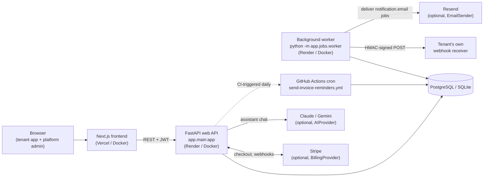
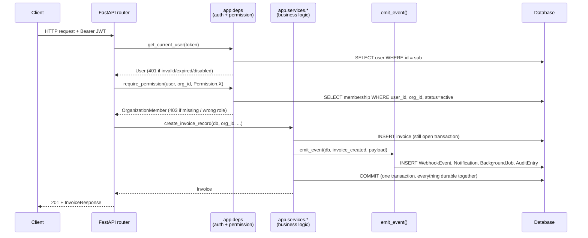
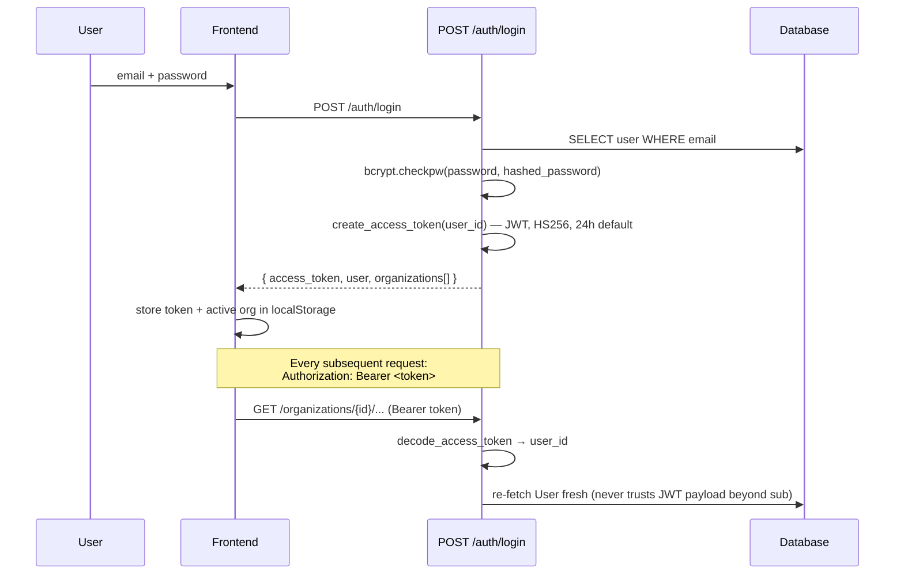
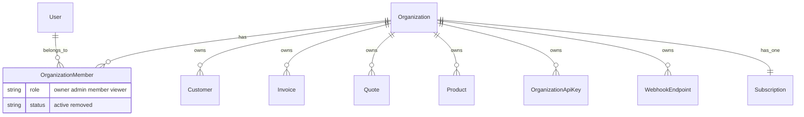
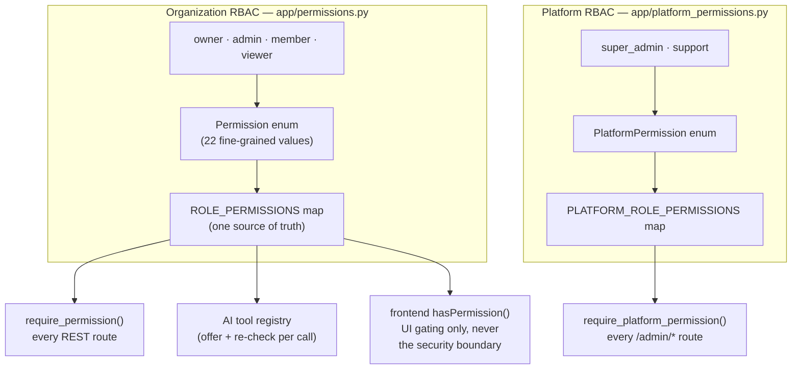
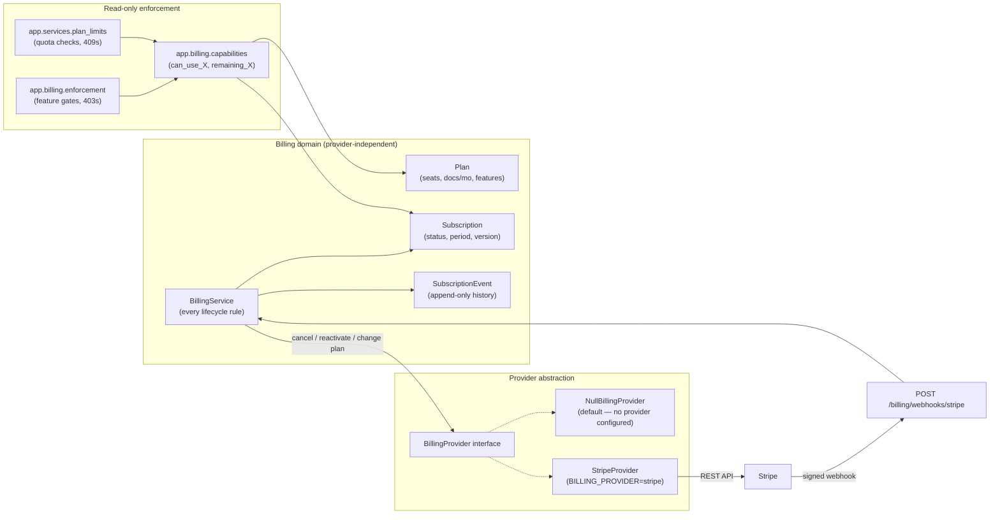
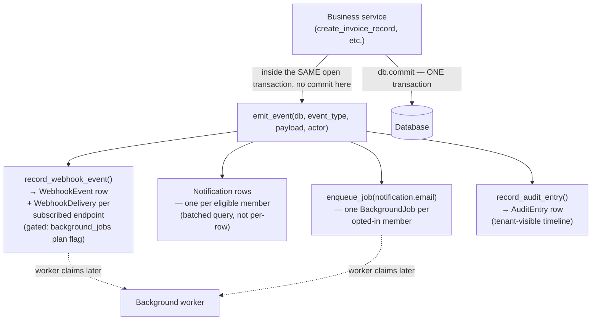
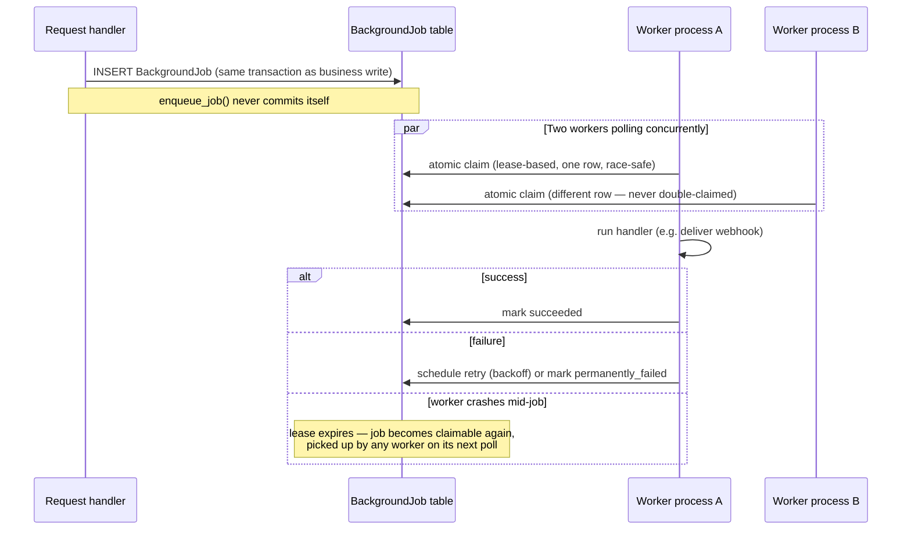
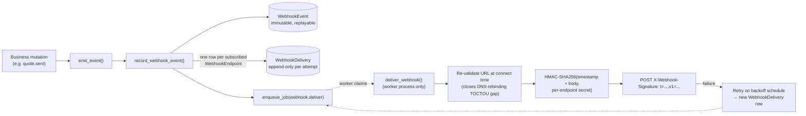

# Architecture

A technical map of how this system is put together: the process
topology, the request lifecycle, and the eleven subsystems that make it
behave like a real multi-tenant SaaS product rather than a CRUD demo.
Each section links back to the source files that are the actual source
of truth — this document explains *why* the code is shaped the way it
is, it doesn't replace reading it.

For deployment topology (which processes run where, in production) see
[deployment.md](deployment.md). For the day-to-day contributor guide see
the main [README](../README.md).

---

## Table of contents

- [System architecture](#system-architecture)
- [Request lifecycle](#request-lifecycle)
- [Authentication flow](#authentication-flow)
- [Organization isolation (multi-tenancy)](#organization-isolation-multi-tenancy)
- [RBAC — role-based access control](#rbac--role-based-access-control)
- [Billing & Stripe](#billing--stripe)
- [Event pipeline](#event-pipeline)
- [Notifications](#notifications)
- [Audit](#audit)
- [Background jobs](#background-jobs)
- [Webhooks](#webhooks)
- [Platform dashboard](#platform-dashboard)

---

## System architecture

The application is **two cooperating backend processes plus a frontend**,
all reading from one database — not a monolith, and not a microservice
mesh either. There's no message broker: the database *is* the queue.

**Why a separate worker instead of `BackgroundTasks` or a broker:**
a request handler can *enqueue* durable work (a webhook delivery, a
notification email) by writing one row to a `BackgroundJob` table in the
same transaction as the business write that produced it — never by
executing the work itself. The worker is the only process that ever
claims and runs that row, via an atomic, lease-based claim that's safe
across multiple worker processes and portable across SQLite and
Postgres. No broker (Redis/RabbitMQ/SQS) means one fewer moving part to
operate for a project this size — see [Background jobs](#background-jobs)
for the full claim/lease mechanics. Running only the web process is a
valid, safe deployment: nothing is lost, delivery is simply deferred
until a worker exists.

**Why one database for everything:** transactional consistency between a
business write and the event it produces is worth more, at this scale,
than the horizontal scalability a separate event store would buy.
`emit_event()` (see [Event pipeline](#event-pipeline)) and
`enqueue_job()` never issue their own commit — they ride inside the
caller's already-open transaction, so a rollback undoes the write *and*
every event/job row it would have produced, atomically.

---

## Request lifecycle

Every authenticated, tenant-scoped write follows the same shape,
regardless of which router it lands in:

The two dependency calls are never skipped: `get_current_user` resolves
identity from the JWT alone (re-checked fresh against the database on
every request — a disabled account or a suspended organization takes
effect on the *next* request, not just the next login), and
`require_permission` resolves both membership *and* the specific
`Permission` the route needs in a single query — see
[RBAC](#rbac--role-based-access-control). Nothing downstream of that
call ever re-derives or trusts a client-supplied `organization_id`
beyond what that membership check already proved.

---

## Authentication flow

- **Passwords**: bcrypt (`app/security.py`), policy enforced at the
  schema layer (min length, upper/lower/digit) and re-validated against
  bcrypt's own 72-*byte* limit — not just 72 characters, which matters
  for multi-byte (non-Latin) passwords.
- **Sessions are stateless JWTs**, not server-side sessions — no session
  table, no server-side revocation list. A disabled user or a removed
  org member is caught by re-checking the *live* database row on every
  request, not by invalidating the token itself.
- **Email verification** and **password reset** are separate,
  single-use, hashed-at-rest token flows (`PasswordResetToken`,
  `EmailVerificationToken`) — the raw token exists only in the outbound
  email and in memory for the duration of one request; only its hash is
  ever persisted.
- **Google Sign-In** (Phase 25, disabled by default) mints the exact same
  JWT via a server-side OAuth 2.0/OIDC authorization-code flow —
  `/auth/google/exchange` returns the identical `AuthResponse` shape as
  `/auth/login`/`/auth/register`. Never trusts a frontend-supplied claim;
  see [`docs/google_auth.md`](google_auth.md) for the full flow, security
  guarantees, and account-linking rules.
- **API keys** (for the public REST API, `/api/v1/...`) are a completely
  separate credential type from a user session — see
  [Organization isolation](#organization-isolation-multi-tenancy) — hashed
  the same way passwords are, shown in full exactly once at creation or
  rotation, and carry their own scoped `ApiKeyPermission` set rather than
  inheriting a user's role.

---

## Organization isolation (multi-tenancy)

Multi-tenancy here is **structural**, not a `WHERE organization_id = ?`
convention a future developer could forget. Every business table
foreign-keys to `Organization`, and there is exactly one way to prove you
belong to one: an active `OrganizationMember` row.

Three independent layers make cross-tenant access structurally hard to
reach by accident:

1. **Every org-scoped route dependency-injects a membership check**
   (`require_org_member` / `require_permission`, `app/deps.py`) before a
   single business-table query runs. Both filter on
   `OrganizationMember.status == active` — a soft-removed member's still
   -valid JWT loses access immediately, not just on next login.
2. **Every lookup function takes `organization_id` as an explicit,
   mandatory parameter** and filters by it directly in the query (e.g.
   `get_invoice_in_org(db, organization_id, invoice_id)`) — there is no
   "fetch by id, check org after" pattern anywhere; a row from another
   organization is never even loaded into memory to be checked.
3. **The AI assistant is bound by the identical boundary.** Every agent
   tool call goes through the same `organization_id`-scoped service
   functions a REST route would — see `tests/tenants/` for a dedicated
   test that specifically tries to trick the assistant into leaking data
   across organizations by manipulating a tool call's arguments.

This is proved, not just asserted: `tests/tenants/test_cross_org_isolation.py`
and `tests/tenants/test_cross_org_resource_leak.py` create two
organizations, populate one, and assert the other's members get a clean
404 (not a 403, which would confirm the resource *exists*) for every
resource type.

---

## RBAC — role-based access control

Two **completely separate** permission systems exist side by side, on
purpose — one for what a user can do *inside their own organization*,
one for what a platform operator can do *across every organization*.
They share no code, no enum, no dependency, and no database table.

**One permission list, three consumers.** `ROLE_PERMISSIONS` is checked
identically whether the caller is a browser session hitting a REST
route, a scoped API key hitting `/api/v1/...`, or the AI assistant about
to execute a proposed tool call. The frontend's own `hasPermission()`
check exists purely to hide buttons a user can't use — it is never the
actual enforcement point, and every route re-checks server-side
regardless of what the UI already hid.

**Relational rules live next to the role map, not inside it.**
`app/role_hierarchy.py` answers a different question than "what can this
role do in general" — it answers "can *this specific actor* act on
*that specific other member*," which is what makes self-promotion
structurally impossible (`can_assign_role`: you can never hand out a
role at or above your own rank) and closes the "last owner" edge case
(`app.services.team`: demoting or removing an owner is blocked, under a
row lock, unless at least one other active owner remains after the
change).

**Platform administration never inherits tenant access.** An
organization owner has zero platform-level permissions no matter how
their organization is configured, and a platform operator's visibility
into a tenant is limited to exactly what the platform-admin surfaces
expose (usage, plan, suspend/reactivate) — never a backdoor into that
organization's actual business records (invoices, quotes, customer PII).
Every platform-admin mutation requires a typed confirmation and a
non-blank reason, written to the [platform audit log](#audit).

---

## Billing & Stripe

Four phases of deliberate separation, each addable without touching the
one before it:

- **`Plan`/`Subscription`/`BillingService`** are the actual source of
  truth for what an organization can do — built and fully tested with
  **zero** provider awareness, before Stripe was ever integrated. Plan
  comparisons are always by `Plan.sort_order`, never by hardcoded plan
  code, so a future custom tier participates in upgrade/downgrade
  classification automatically.
- **`BillingProvider`** (`app/billing/provider_base.py`) is a small
  interface `BillingService` depends on and nothing else — never a
  concrete SDK. `NullBillingProvider` is the default (`BILLING_PROVIDER`
  unset): every provider-backed method fails closed
  (`BillingProviderNotConfiguredError`) rather than silently no-oping,
  so a misconfigured deployment can't accidentally "succeed" at
  something it never actually did.
- **Every mutation that should reach Stripe does, exactly once.**
  `cancel_immediately`, `cancel_at_period_end`, `reactivate`, and
  `change_plan` each push to the configured provider *before* mutating
  local state — a provider failure leaves the local row completely
  untouched (no local/provider divergence), and every outbound Stripe
  call carries a deterministic Idempotency-Key, so a retry after a
  transient failure can never double-charge or double-cancel. The one
  exception is deliberate: when `sync_from_webhook_event` is *reacting*
  to something Stripe already told us happened (a
  `subscription.deleted` event, a completed checkout), it never pushes
  back — that would be redundant at best, an error at worst.
- **Local optimistic concurrency, independent of Stripe.**
  `Subscription.version` uses SQLAlchemy's `version_id_col` — two
  writers (a platform-admin action and an incoming Stripe webhook)
  racing on the same row is resolved at the database layer, surfaced as
  a `SubscriptionConflictError` → `409`, never a silent last-write-wins.
  See `tests/billing/test_subscription_concurrency.py` for a genuine
  two-thread race reproduction, not just a unit assertion.
- **Webhook idempotency**: every inbound Stripe event's `event_id` is
  recorded (`ProviderWebhookReceipt`) in the *same* transaction as the
  mutation it drives — a redelivered event (Stripe's own retry
  behavior) is detected and safely ignored, never re-applied.

See [`docs/billing_providers.md`](billing_providers.md) for the full
provider-interface reference and how to add a second concrete provider.

---

## Event pipeline

The backbone every other subsystem in this document (webhooks,
notifications, audit) is a *consumer* of, not a parallel implementation
of. **Frozen by design**: `app.notifications.service.emit_event` is the
one and only entry point a business service ever calls to say "this
happened" — never a second call site anywhere that reacts to a mutation
directly.

**Why this shape:** a business service (`create_invoice_record`,
`mark_quote_accepted_record`, ...) has zero awareness that webhooks,
in-app notifications, audit history, or email exist — it calls
`emit_event()` once and moves on. Adding a *fifth* channel (Slack, SMS,
analytics) means adding one more line inside `emit_event`'s own fan-out
— never touching invoice/quote/customer domain logic, and never adding a
second call site that could silently drift out of sync with the first.
`app.webhook_event_type.WebhookEventType` is the single closed catalog
every channel reads from — an event type that doesn't exist there can't
be emitted by any of them.

**Nothing here performs I/O or commits.** `emit_event`, `record_webhook_event`,
and `record_audit_entry` all just `db.add(...)` rows into the caller's
already-open session. The *caller's* own `db.commit()` — the one
already sitting at the end of the business mutation — is what makes the
write and all four channels' rows durable together, atomically. If the
request fails after `emit_event` but before that commit, none of it
happened: not the invoice, not the webhook event, not the notification,
not the audit row.

---

## Notifications

Two channels, one write path, gated independently per member:

- **In-app inbox** (`Notification` table) — always created for every
  eligible active member, a baseline capability on every plan.
- **Email** — only enqueued for a member who hasn't opted out
  (`NotificationPreference.email_enabled`, defaults to `True` when no
  row exists — see that model's own docstring for why "absent" means
  "default," not "off"). Delivered asynchronously by the background
  worker (`notification.email` job type), never inline in the request
  that triggered it.

Eligibility resolution is a **batched** query
(`NotificationPreference.user_id.in_(member_ids)`,
`User.id.in_(member_ids)`) — not one query per organization member —
specifically because `emit_event`'s fan-out runs synchronously inside
every business mutation's request; an O(n) query pattern here would have
made every write in the app scale with team size.

See [`docs/notifications.md`](notifications.md) for the full channel
reference, copy-rendering pipeline, and the governance rule that keeps
this the single fan-out point.

---

## Audit

Two **structurally distinct** audit surfaces exist, deliberately never
merged, because they answer different questions for different
audiences:

| | `AuditEntry` (tenant) | `PlatformAuditLog` (platform) |
| --- | --- | --- |
| Who sees it | The organization's own members (Settings → Audit Log) | Platform operators only (`/admin/audit-log`) |
| What it records | Business-domain events — customer/product/quote/invoice lifecycle | Platform-administration actions — suspend, plan change, role grant |
| Written from | `emit_event`'s own fan-out (same path as webhooks/notifications) | `record_organization_action()`, called explicitly from each `/admin/*` mutation |
| Mandatory reason | No — these are ordinary business events | **Yes** — every platform action requires actor + non-blank reason |
| Mutable? | Never — append-only | Never — append-only |

A third, narrower table, `WebhookAuditLog`, exists purely for
webhook-*endpoint configuration* changes (create/rotate-secret/disable)
— not to be confused with either of the above.

The tenant `AuditEntry` channel is exactly what the event-pipeline
governance rule anticipated: a fourth consumer added *inside*
`emit_event`'s fan-out, reusing the same `WebhookEventType` catalog and
the same JSON payload the webhook channel already builds — see
[`docs/audit_timeline.md`](audit_timeline.md).

---

## Background jobs

A durable, database-backed queue — no broker, portable across SQLite
(dev) and Postgres (production).

- **Enqueue is transactional.** `enqueue_job()` is called from inside an
  already-open business transaction (directly, or via `emit_event`) and
  never issues its own commit — a rolled-back request rolls back the
  job row with it.
- **Claiming is atomic at the database layer**, not coordinated in
  application code — verified with two real worker processes racing for
  the same batch, never double-claiming a row.
- **Crash recovery is real, not assumed.** A worker that dies mid-job
  leaves its claim behind; once the lease duration
  (`WORKER_LEASE_DURATION_SECONDS`) expires, the job becomes claimable
  again automatically. Tested against an intentionally-killed worker
  process, not just asserted in a unit test.
- **The web process never executes a job itself** — `deliver_webhook()`
  and every other handler is invoked from exactly one call site: inside
  the worker's own claim loop. A slow or unreachable third-party
  receiver can never make an API request hang.

Job types today: webhook delivery (with automatic backoff retries) and
notification email delivery. Both share the identical queue, claim
mechanism, and failure/retry semantics — a future job type is a new
handler module registered in `app/jobs/registry.py`, nothing else.

---

## Webhooks

Outbound, tenant-configured, HMAC-signed, and event-driven — never
polled.

- **Events are immutable; delivery history is append-only.** A
  `WebhookEvent`, once written, never changes — it's the permanent
  record of "this happened." Every delivery *attempt* against a
  subscribed endpoint gets its own `WebhookDelivery` row rather than
  overwriting a status field, so an organization can see every attempt,
  every response code, every retry, for an event from weeks ago.
- **SSRF-hardened, twice.** An endpoint URL is entirely
  organization-controlled — the textbook SSRF target. It's validated
  (scheme, no embedded credentials, DNS resolution rejecting
  loopback/private/link-local/reserved ranges) both at creation time and
  again immediately before every delivery attempt, with the *same*
  check re-run at actual TCP-connect time — closing the gap where a
  hostname could resolve safely at validation and resolve to an internal
  address moments later (DNS rebinding).
- **Signed, not just delivered.** `X-Webhook-Signature: t=<unix
  timestamp>,v1=<hex hmac>` — signing the timestamp *alongside* the body
  (not just the body) is what lets a receiver reject a replayed request
  outside a small tolerance window, the same scheme Stripe's own
  outgoing webhooks use.
- **Plan-gated, gracefully.** Outbound delivery infrastructure
  (`can_use_background_jobs`) is a paid-plan feature; on a plan without
  it, the `WebhookEvent` row is still written (nothing about the event
  itself is lost) — only the `WebhookDelivery`/job enqueue is skipped.

---

## Platform dashboard

A separate console (`/admin/*`, `PlatformAdminShell` in the frontend),
gated by [platform RBAC](#rbac--role-based-access-control), for
operating the platform rather than using it as a tenant:

- **Organizations** — list, inspect usage against plan limits,
  suspend/reactivate (typed confirmation + mandatory reason), change
  plan.
- **Users** — list, inspect, disable/enable, grant/revoke platform
  roles, trigger a password-reset email, manually verify an email.
- **Plans** — create/edit commercial plan definitions (limits, feature
  flags) with optimistic concurrency (`version` column) against two
  operators editing the same plan simultaneously.
- **Subscriptions** — the platform-admin view onto every
  organization's [`Subscription`](#billing--stripe), including the
  cancel/reactivate/change-plan actions that now push to Stripe when a
  provider is configured.
- **Background jobs** — operational visibility into the durable queue:
  pending/claimed/failed counts, per-job detail (payload, attempts,
  lease state), manual retry/cancel.
- **Audit log** — the read-only, append-only [platform action
  history](#audit) — every suspension, plan change, and role grant,
  with actor and reason.
- **System health / settings** — platform-wide toggles (maintenance
  mode, registration on/off) and operational metrics.

See [`docs/platform_operations_dashboard.md`](platform_operations_dashboard.md)
for the full route-by-route reference.
